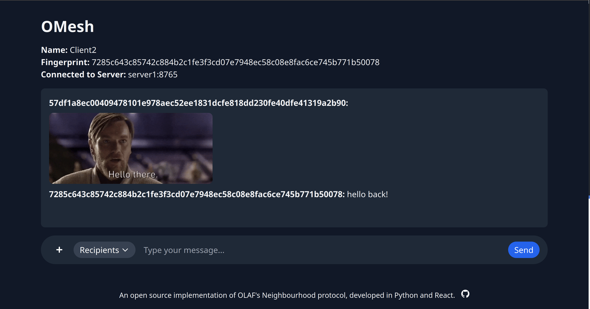

# OMesh: An Implementation of OLAF's Neighbourhood Protocol

An open-source implementation of the OLAF's Neighbourhood protocol, developed using Python and React.

**Group Members:** Samuel Chau and Menno Brandt

## Preview



---

## Table of Contents

- [General Description](#general-description)
- [Technologies Used](#technologies-used)
- [Protocol Overview](#protocol-overview)
- [Implementation Details](#implementation-details)
- [Requirements](#requirements)
- [Setup](#setup)
- [Usage](#usage)
- [Docker Compose File Explanation](#docker-compose-file-explanation)
- [Scripts Explanation](#scripts-explanation)
- [Additional Notes](#additional-notes)
- [Acknowledgements](#acknowledgements)

---

## General Description

OMesh is an implementation of OLAF's Neighbourhood protocol, designed to facilitate secure and decentralized messaging across a network of servers and clients. The protocol combines aspects of the original OLAF protocol with the Neighbourhood protocol to create a meshed network where servers are interconnected, and clients communicate through their home servers.

This project demonstrates key features such as client-to-client messaging, server-to-server communication, end-to-end encryption, and file transfers, all encapsulated within Docker containers for ease of deployment and testing.

---

## Technologies Used

- **Python 3.9**: Core language for server and client implementations.
- **WebSockets (RFC 6455)**: For real-time communication between clients and servers.
- **Flask**: A micro web framework for the client-side API.
- **React**: For the frontend user interface.
- **Vite**: A build tool for frontend assets, providing faster builds and optimized outputs.
- **Docker & Docker Compose**: Containerization and orchestration of services.
- **Cryptography Library**: For RSA and AES encryption implementations.
- **aiohttp**: Asynchronous HTTP client/server framework.
- **Asyncio**: For asynchronous programming in Python.

---

## Protocol Overview

### General Overview

The OLAF's Neighbourhood protocol is designed to enable secure, encrypted communication between clients in a decentralized network. Key components include:

- **Users**: Identified by unique RSA key pairs and fingerprints derived from their public keys.
- **Servers**: Act as relays, forwarding messages between clients and other servers.
- **Neighbourhood**: A meshed network of servers where each server is aware of and connected to every other server.
- **Messages**: JSON-formatted, UTF-8 encoded messages that follow a specific protocol for communication.

### Features

- **Client Registration**: Clients send a `hello` message to their home server to establish their identity.
- **End-to-End Encryption**: Messages are encrypted using RSA and AES encryption schemes.
- **Client Discovery**: Clients can request a list of currently connected clients.
- **Message Routing**: Servers forward messages to the appropriate destination servers.
- **File Transfers**: Clients can upload and download files through HTTP APIs.
- **Replay Attack Prevention**: Messages include counters and signatures to prevent replay attacks.

---

## Implementation Details

### How the Protocol Has Been Implemented

- **WebSockets for Communication**: Both client-server and server-server communications are handled via WebSockets, enabling real-time data exchange.
- **Asynchronous Programming**: Utilizes Python's `asyncio` library for non-blocking IO operations.
- **RSA and AES Encryption**: Implements RSA for asymmetric encryption and signing, and AES-GCM for symmetric encryption.
- **Dockerized Services**: All components are containerized, allowing for easy deployment and scaling.
- **React Frontend with Vite**: Provides a user-friendly interface for clients to send messages and upload files, built using React and bundled with Vite for optimized performance.

### Features Implemented

- **Client Registration and Authentication**
- **Secure Messaging with Encryption**
- **Server Discovery and Neighbourhood Formation**
- **Client List Retrieval**
- **Public and Private Chat Messaging**
- **File Upload and Download Functionality**
- **Message Logging and Debugging Options**

---

## Requirements

- **Docker**: Ensure Docker is installed and running on your system.
- **Docker Compose**: Required for orchestrating multi-container Docker applications.
- **Node.js and NPM**: For building the React frontend.
- **Python 3.9**: Necessary for running scripts outside Docker, if needed.

---

## Setup

### Cloning the Repository

```bash
git clone https://github.com/santiagosayshey/OMesh.git
cd OMesh
```

### Building the React Frontend

To build the React frontend and start the application, simply run:

```bash
./start.sh
```

This script will:

- Build the React frontend using Vite.
- Deploy the build to the Flask client.
- Use Docker Compose to build and start all services defined in the `docker-compose.yml` file.

Alternatively, if you wish to manually build the frontend and start the application, you can follow these steps:

1. **Navigate to the frontend directory**:

   ```bash
   cd frontend
   ```

2. **Install the dependencies**:

   ```bash
   npm install
   ```

3. **Build the React application**:

   ```bash
   npm run build
   ```

4. **Deploy the build to the Flask client**:

   ```bash
   cd ..
   ./deploy.sh
   ```

5. **Build and start Docker containers**:

   ```bash
   docker-compose up --build
   ```

---

## Usage

### Running the Application

After running `./start.sh`, the Docker containers for servers and clients will be up and running. The clients can be accessed via their exposed ports.

For example, to access `client1`, open your web browser and navigate to `http://localhost:5001`.

### Interacting with the Chat Application

The chat application provides a familiar, Discord-like interface, allowing for seamless communication and file sharing between users.

- **Sending Messages**: Use the chat interface to send public or private messages to other users.
- **Uploading Files**: Click the file upload button (represented by a '+' icon) to send files to other users.
- **Selecting Recipients**: Choose recipients from the list to send private messages or files. You can select multiple users or opt for a global chat.

### Adding a Server

To add a new server:

1. **Update the `docker-compose.yml` file**:

   - Add a new service under the `services` section.
   - Use the existing server configurations as a template.
   - Assign a unique name and container name.
   - Set the appropriate ports and environment variables.

2. **Specify Environment Variables**:

   - `SERVER_ADDRESS`: Unique address for the new server.
   - `SERVER_PORT`: Port for client connections.
   - `SERVER_SERVER_PORT`: Port for server-to-server connections.
   - `NEIGHBOUR_ADDRESSES`: Include addresses of all other servers in the neighbourhood.

3. **Update Existing Servers**:

   - Add the new server's address to the `NEIGHBOUR_ADDRESSES` of all existing servers.

4. **Rebuild and Restart Containers**:

   ```bash
   docker-compose down
   docker-compose up --build
   ```

### Adding a Client

To add a new client:

1. **Update the `docker-compose.yml` file**:

   - Add a new service under the `services` section.
   - Use the existing client configurations as a template.
   - Assign a unique `CLIENT_NAME`.
   - Expose a new port for the client.
   - Set the `SERVER_ADDRESS` to the desired server the client should connect to.

2. **Rebuild and Restart Containers**:

   ```bash
   docker-compose down
   docker-compose up --build
   ```

### Environment Variables

#### Server Environment Variables

- `SERVER_ADDRESS`: The address of the server (used within Docker networking).
- `SERVER_PORT`: Port for client WebSocket connections.
- `SERVER_SERVER_PORT`: Port for server-to-server WebSocket connections.
- `HTTP_PORT`: Port for HTTP file transfers.
- `NEIGHBOUR_ADDRESSES`: Comma-separated list of neighboring servers in the format `address:port`.
- `LOG_MESSAGES`: Set to `True` to enable detailed message logging.
- `PUBLIC_HOST`: Hostname or IP address accessible by clients for file downloads.

#### Client Environment Variables

- `SERVER_ADDRESS`: The address of the server the client connects to.
- `SERVER_PORT`: Port for client WebSocket connections.
- `CLIENT_NAME`: A unique identifier for the client.
- `LOG_MESSAGES`: Set to `True` to enable detailed message logging.

---

## Docker Compose File Explanation

The `docker-compose.yml` file defines all services (servers and clients) in the network.

A sample `docker-compose.yml` has been provided with 4 servers and 8 clients (2 clients per server), offering a ready-to-use setup for testing and demonstration purposes.

### Overview of Services

- **Servers (`server1`, `server2`, `server3`, `server4`)**:

  - **Build Configuration**: Use the `server/Dockerfile` to build the server image.
  - **Ports**:
    - Expose WebSocket ports for client connections.
    - Expose WebSocket ports for server-to-server connections.
    - Expose HTTP ports for file transfers.
  - **Volumes**:
    - Mount directories for client public keys (`clients`) and uploaded files (`files`).
  - **Environment Variables**:
    - Define `SERVER_ADDRESS`, `SERVER_PORT`, `NEIGHBOUR_ADDRESSES`, etc.
  - **Networking**:
    - Connect to the `olaf_network` Docker network, enabling communication between services.

- **Clients (`client1` to `client8`)**:

  - **Build Configuration**: Use the `client/Dockerfile` to build the client image.
  - **Ports**:
    - Expose ports for the Flask web interface.
  - **Environment Variables**:
    - Define `SERVER_ADDRESS`, `CLIENT_NAME`, etc.
  - **Dependencies**:
    - Use the `depends_on` attribute to ensure the client starts after its designated server.
  - **Networking**:
    - Connect to the `olaf_network` Docker network.

### Environment Variables for Server and Client

Each service defines environment variables that configure its behavior, such as the server address, ports, neighbor servers, and logging preferences.

---

## Scripts Explanation

### `start.sh`

A convenience script to build the React frontend and start all Docker containers.

#### Steps:

1. **Build React Application**:

   - Runs `npm run build` in the `frontend` directory using Vite.
   - This compiles the React application into static files.

2. **Deploy the Build**:

   - Copies `index.html` to the Flask `templates` directory.
   - Copies static assets to the Flask `static` directory.
   - Ensures that the Flask application serves the latest frontend build.

3. **Build and Start Docker Containers**:

   - Stops any running containers with `docker-compose down`.
   - Builds and starts containers with `docker-compose up --build`.
   - Docker Compose orchestrates the building and running of all defined services.

### `deploy.sh`

A script to build the React frontend and deploy it to the Flask client.

#### Steps:

1. **Build React Application**:

   - Runs `npm run build` in the `frontend` directory using Vite.
   - This step generates the production-ready frontend assets.

2. **Copy Build to Flask Directories**:

   - Copies `index.html` to the Flask `templates` directory.
   - Copies static assets (e.g., JavaScript, CSS files) to the Flask `static` directory.
   - Ensures that the Flask application serves the frontend correctly.

---

## Additional Notes

- **Logging**: Detailed logging can be enabled by setting the `LOG_MESSAGES` environment variable to `True`. This will log detailed message contents for debugging purposes.
- **File Size Limit**: The server imposes a maximum file size limit (e.g., 10 MB) for uploads to prevent excessive resource usage.
- **Replay Attack Prevention**: Messages include a counter and signature to prevent replay attacks, ensuring message integrity and authenticity.
- **User Interface**: The chat application provides a familiar, Discord-like interface for ease of use.
- **Group Members**: Samuel Chau and Menno Brandt contributed to this project.

---

## Acknowledgements

This project is developed as an assignment to demonstrate the implementation of a secure messaging protocol using modern web technologies and encryption practices.

---

# End of README
